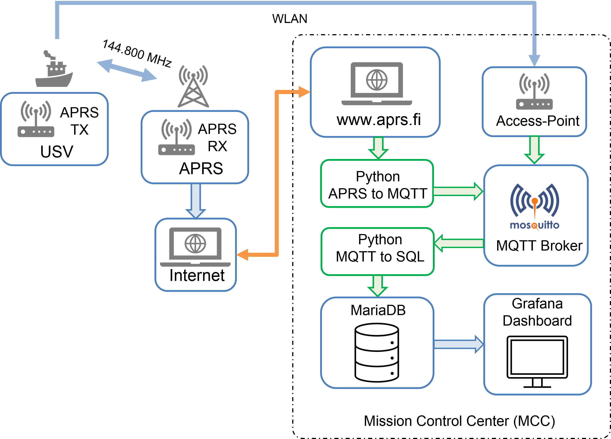

## Dokumentation zum Datenmanagement zwischen ARRS - MQTT - MariaDB

 Datei | Beschreibung
-------|-------------
APRS-Daten.pdf | Aufbau der APRS-Datenstruktur pro Sendedurchgang 
MQTT_to_SQL.pdf | Umwandlung von APRS-Daten in MQTT Daten sowie Ablage der MQTT-Daten in einer SQL-Datenbank

### Übersichtsdarstellung Datenkommunikation zum MCC

