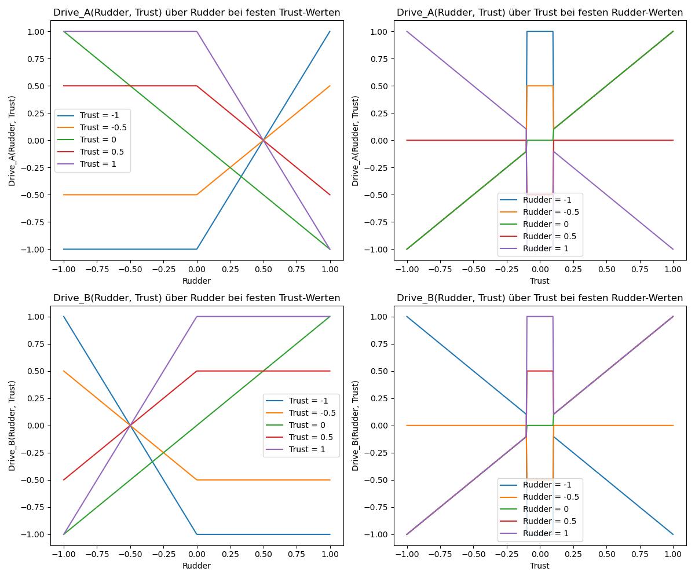

# kurze Demoprogramme für die Benutzung von spezifischen Modulen

1. test_uart.py (UART für TX und RX über ein PIO-Modul)
2. rudder_demo.py (Steuerfunktionen für Trust und Rudder)
3. rudder_demo_1.ipynb (Steuerfunktionen für jupyter notebook)
4. rudder_demo_2.ipynb (Steuerfunktionen für jupyter notebook)

