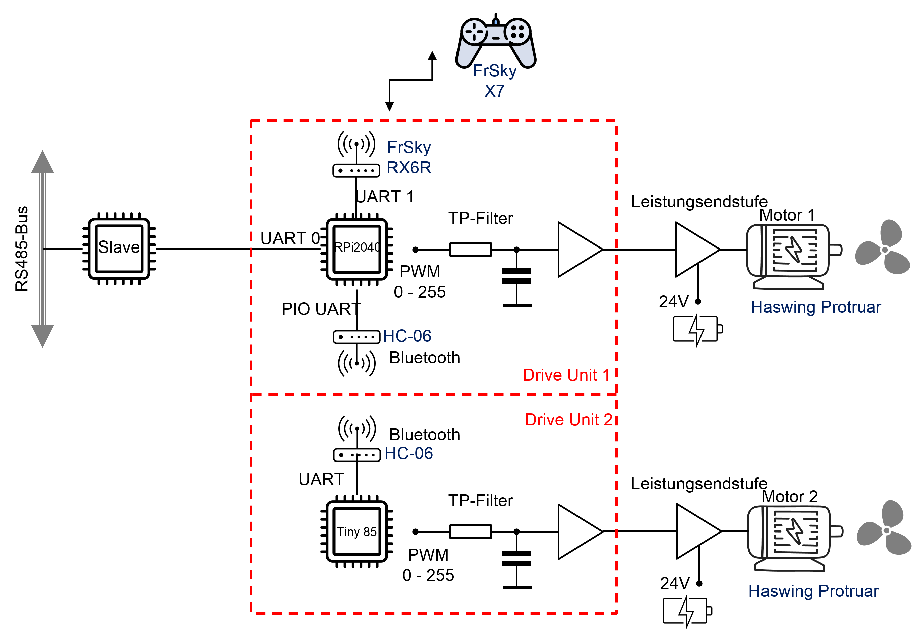

## Antriebseinheit (Drive)

1. Dokumentation
2. Hardware
3. Software (Firmware)

### Ansteuerkonzept

####Drive Unit 1

Das Hardwaremodul Drive Unit 1 ist ein weiteres Slave-Modul im Gesamtsystem des USV. Die Ansteuerung erfolgt prinzipiell über das Bussystem des USV. Dabei werden die Stellgrößen (AS1-Schub und AS2-Ruder) der Antriebsregelung auf die beiden Antriebsmotoren übertragen. Drive Unit 1 empfängt die Businformation und berechnet daraus den Schub und die Schubdifferenz (Ruder) für die Einzelmotoren. Weiterhin wird unter Berücksichtigung der Ansteuerkennlinie der Motor 1 angesteuert.
Die Ansteuerung des Motors 2 erfolgt über die Bluetooth-Schnittstelle. Dabei wird nur noch der Schub für den Motor 2 übertragen. 
Fehlersignale der Leistungsendstufe werden an den lokalen Error Block (ER7) zurückgesendet.    

####Drive Unit 2

Das Hardwaremodul Drive Unit 2 ist kein eigenständiges Slave-Modul im Gesamtsystem des USV. Es dient lediglich dazu aus der Schubinformation für den Motor 2 das entsprechende PWM-Signal für den Motor 2 zu erzeugen. Mögliche Fehlersignale aus der leistungsendstufe des Motors2 werden an das Drive Unit 1 Modul gesendet, welche diese Fehler in den lokalen Error Block (ER7) integriert.   

