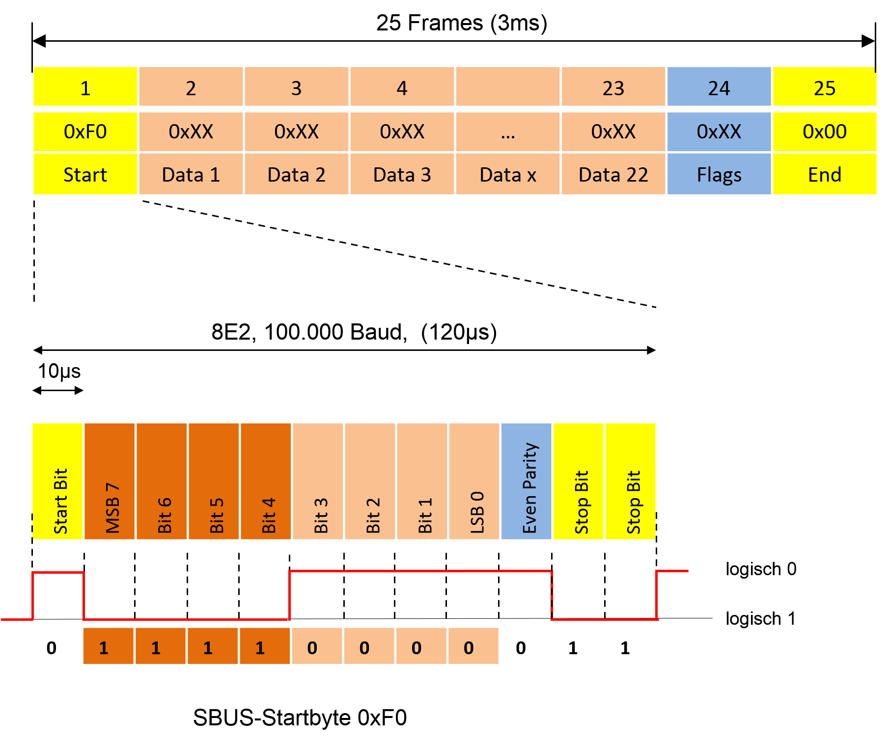

## Futaba SBUS

a Micropython driver for the SBUS protocol on Rpi Pico

It supports 16 standard Channels plus 2 digitals.

It has been tested only on the below FrSky receivers:

    RX6R

An example of usage can be found in the file sbus_driver_example.py

