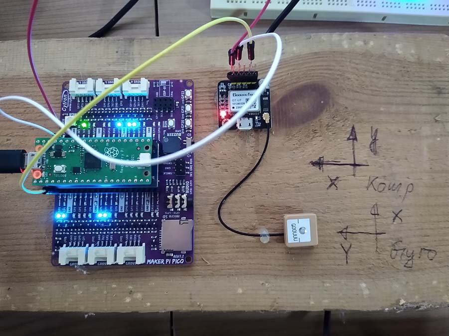

## Testmessung für Kalmanfilter (GPS+IMU).
Messung und räumliche Kombination mehrerer Inertialsensoren.
Die Bewegung erfolgte im Gyrokoordinatensystem in Richtung der x-Achse

Messgrößen sind:
- Beschleunigung in ax, ay, az
- Drehraten in gx, gy, gz
- Timestamp
- Latitude, Longitude, Speed
- Satelliten

