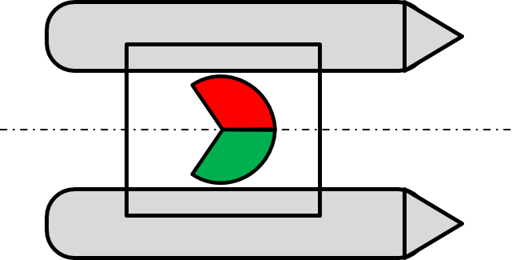

## Lichterführung des USV

Die korrekte Lichterführung ist für die Navigation auf See von großer Bedeutung und helfen bei der Vermeidung von Zusammenstößen oder Havarien auf dem Wasser. Positionslichter, auch als Sichtzeichen bezeichnet, zeigen bei schlechter oder verminderter Sicht und nachts Position, Zustand, Situation und Lage (die relative Position zum eigenen Schiff), von Schiffen an. Die Anordnung, Farben und Kombination der verschiedenen Positionslichter ergibt die Lichterführung.

### Kollisionsverhütungsregeln – KVR

**Regel 22**

Auf Fahrzeugen von weniger als 12 Meter Länge
- Topplicht, 2 Seemeilen
- Seitenlicht, 1 Seemeile
- Hecklicht, 2 Seemeilen
- Schlepplicht, 2 Seemeilen
- weißes, rotes, grünes oder gelbes Rundumlicht, 2 Seemeilen.

**Regel 23 Maschinenfahrzeuge in Fahrt**

(d )( i)

Ein Maschinenfahrzeug von weniger als 12 Meter Länge darf an Stelle der unter Buchstabe a vorgeschriebenen Lichter ein weißes Rundumlicht und Seitenlichter führen;

(d)(ii)

Ein Maschinenfahrzeug von weniger als 7 Meter Länge, dessen Höchstgeschwindigkeit 7 Knoten nicht übersteigt, darf an Stelle der unter Buchstabe a vorgeschriebenen Lichter ein weißes Rundumlicht und muß, wenn möglich, außerdem Seitenlichter führen;

(d)(iii)

Das Topplicht oder das weiße Rundumlicht auf einem Maschinenfahrzeug von weniger als 12 Meter Länge darf außerhalb der Längsachse des Fahrzeugs geführt werden, wenn die Anbringung über der Längsachse nicht möglich ist, vorausgesetzt, daß die Seitenlichter in einer Zweifarbenlaterne über der Längsachse des Fahrzeugs geführt oder so nahe wie möglich in derselben Längsachse wie das Topplicht oder das weiße Rundumlicht angebracht werden.

