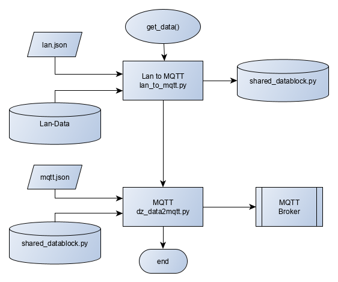

## Dokumentation zum MQTT-Client des USV 

 Datei | Beschreibung
-------|-------------
mqtt_to_sql.json | Konfigurationsdaten für MQTT-Broker und SQL-Server
mqtt_to_sql.py | MQTT-Client
mqtt_to_sql.log | Logdatei für MQTT-Client
lan_to_mqtt.py | Binary Daten vom WLan/Lan zum MQTT Broker senden
mqtt.json | Konfiguration für MQTT-Broker
dz_data2mqtt.py | Shared_Datablock an MQTT-Broker senden 

## Übersichtsdarstellung des Datenfluss der einzelnen Module

#### Datenkanal vom MQTT-Broker zur SQL-Datenbank

#### Datenkanal zum MQTT-Broker

