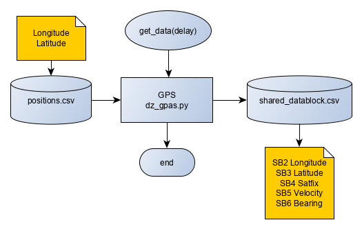
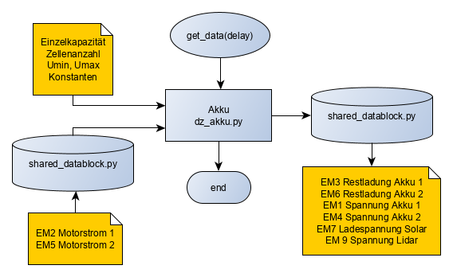
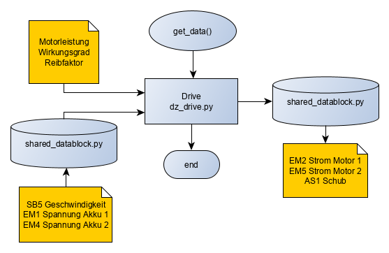

## Dokumentation zum digitalen Zwilling des USV 

 Datei | Beschreibung
-------|-------------
Datenblock.csv | Datenblock in der Buskommunikation
positions.csv | vordefinierte Route 
aprs.json | Konfiguration für virtuellen APRS Transmitter
aprs_config.py | erzeugt Konfiguration für virtuellen APRS-Transmitter
dz_ship.py | digitaler Zwilling des USV 
dz_gps.py | digitaler Zwilling des GPS 
dz_akku.py | digitaler Zwilling der Akkus
dz_data2packet | wandelt Daten vom virtuellen Bus (shared_datablock) in APRS Daten
dz_aprs_tx.py | virtueller APRS-Transmitter
shared_datablock.py | Dictionaray für Datenblock (virtueller Bus) zur Buskommunikation 
nautic.py | Tool für nautische Berechnungen 

### Übersichtsdarstellung der Einzelmodule

#### GPS

#### Akku

#### Antriebsmotoren

