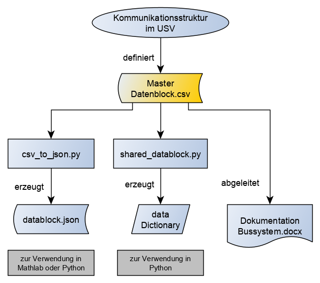

## Tools zur Behandlung des Datenblocks

Die Kommunikation zwischen dem Master und den einzelnen Slave-Modulen erfolgt über einen 1024-Byte großen Datenblock. Um die Adresszuordnung flexibel zu gestalten, können die Slave-Module über eine ID auf die jeweilige Adresse zugreifen. Der aktuelle Datenblock ist immer in der Datei „Datenblock.csv“ hinterlegt.

### Aufbau des csv-Datenblocks (Beispiel)

|Adresse hex|Adresse dec|Länge|Schlüssel|Wert|
|-----|-----|----|-----|-----|
| 0x9 | 9   | 2  | SB4 | 7   |
| 0xA | 10  | 1  | SB5 | 5.1 |

###	Konvertierungstools
	csv_to_json.py			erzeugt aus Datenblock.csv datablock.json
	shared_datablock.py		erzeugt aus Datablock.csv dein Python Dictionary zur weiteren Nutzung

### json-Behandlung in Matlab
    % Pfad zur JSON-Datei
    jsonDateiPfad = 'datablock.json';
    % JSON-Datei einlesen
    jsonDaten = fileread(jsonDateiPfad);
    % JSON-Daten decodieren
    struktur = jsondecode(jsonDaten);
    % Zugriff auf die Daten in der Struktur
    disp(struktur);

### json-Behandlung in Python
    json_file = 'datablock.json'
    with open(json_file, 'r') as json_data:
        datablock = json.load(json_data)
		
### Dictionary Aufbau in Python (Beispiel)

|Schlüssel|Type|Größe|Wert|
|------|--------|---|-----|
| AS1  | Float  | 1 | 100 |
| AS2  | Float  | 1 | 150 |

